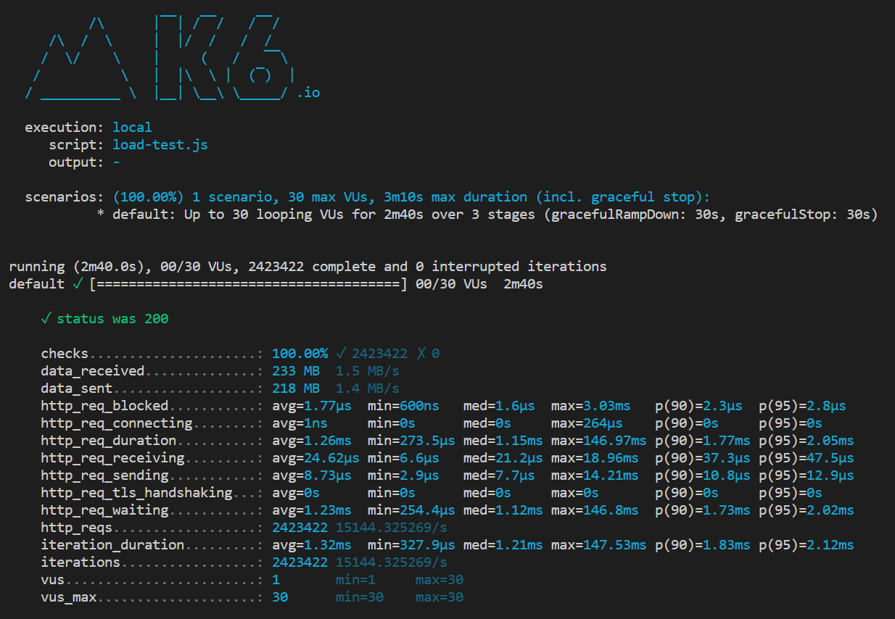

# Quarkus performance comparison

By running `k6 run load-test.js` we are able to get a performance of our services.
Each service is a simple hello world with a path parameter for passing a name.
The services are all hit with the same performance test script.

## Callouts (TLDR)

**Results**
- Spring WebFlux had the highest raw throughput follwed by Quarkus Mutiny
- Quarkus has double the throughput per MiB
- Almost two Quarkus Mutiny applications can be spun up in the same memory allocation as one Spring WebFlux application
- Quarkus Spring-Web handles 57% more requests than Spring Web (mostly using the same code!)

**Disclaimers**
- None of these frameworks are being used to their full potential
- Quarkus applications can be easilly packaged into Native executables reducing their memory fooprint

## Raw numbers

Below are the raw numbers for the performance tests run.

### Spring-web

Memory footprint before the test began = 207 MiB

Memory footprint when the test completed = 354 MiB

Requests per second per MiB = 26.6

### Spring-webflux (reactive)

Memory footprint before the test began = 213 MiB

Memory footprint when the test completed = 566 MiB

Requests per second per MiB = 26.8

### Quarkus Spring-web

Memory footprint before the test began = 156 MiB

Memory footprint when the test completed = 294 MiB

Requests per second per MiB = 50.1

### Quarkus mutiny (reactive)

Memory footprint before the test began = 143 MiB

Memory footprint when the test completed = 297 MiB

Requests per second per MiB = 50.4

